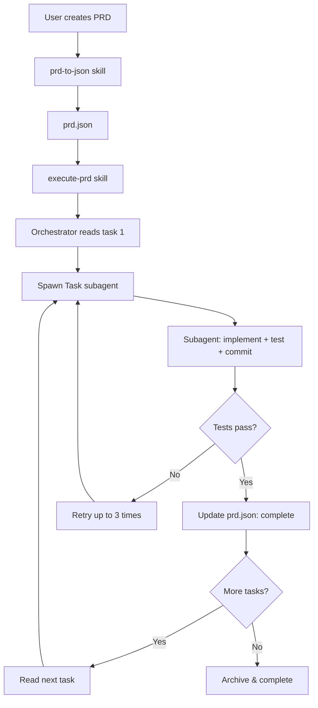

> ⚠️ **DEPRECATED** — The autonomous execution system has moved to Pi subagents.
> See `.pi/skills/execute-prd/SKILL.md` for the current workflow.
> Execution state now lives in `dev/executions/<plan-slug>/`.
> Static templates and reference files in this directory remain until full legacy cleanup (Phase 2).

# Autonomous Agent Loop (Areté Development Only) — DEPRECATED

⚠️ **INTERNAL TOOLING** - This system is for developing Areté itself, not for end users.

## What This Is

An autonomous agent loop that helps Areté developers (maintainers of this repo) build features by executing PRD tasks sequentially with fresh context per task.

Inspired by [Ralph](https://github.com/snarktank/ralph), adapted for Cursor-native execution using the Task tool.

## What This Is NOT

- **NOT** a feature for Areté users (PMs who install Areté)
- **NOT** shipped via `arete install`
- **NOT** exposed in the `arete` CLI
- **NOT** part of the Areté product

## Who Uses This

Areté maintainers working in this repository to build new Areté features.

## Prerequisites

Before using the autonomous system:

1. **Read `AGENTS.md`** (repository root) - Contains architecture, patterns, and context about Areté
2. **Understand the codebase** - TypeScript, NodeNext, ES modules with `.js` extensions
3. **Have tests passing** - Run `npm test` and `npm run typecheck` before starting

## Quick Start

### 1. Create a PRD for the Feature

Use the standard `create-prd` skill to write a markdown PRD:

```
Load the create-prd skill and write a PRD for [feature name]
```

This creates a PRD in `projects/active/{name}/outputs/prd-{name}.md`.

### 2. Convert PRD to JSON

```
Load the prd-to-json skill from .agents/skills/prd-to-json/ and convert projects/active/{name}/outputs/prd-{name}.md to prd.json
```

This creates `dev/autonomous/prd.json` with structured tasks.

### 3. Execute Autonomously

```
Load the execute-prd skill from .agents/skills/execute-prd/ and execute the PRD
```

The orchestrator will:
- Spawn a fresh Task subagent for each task (when the Task tool is available)
- Run tests and typecheck after each task
- Commit successful tasks with proper messages
- Track progress in `progress.txt`
- Continue until all tasks complete (or max iterations)

If the Task tool is not available in your environment, the execute-prd skill allows fallback. A custom subagent at `dev/autonomous/prd-task-agent.md` gives fresh context per task when Cursor exposes it as a tool (see [Subagents](https://cursor.com/docs/context/subagents); Cursor Plus/usage-based have them on by default): the same agent executes each task in sequence (one task at a time, same quality gates and prd/progress updates). See the skill’s Step 3 for details.

### 4. Review and Merge

After completion:
- Review commits: `git log`
- Run tests locally: `npm test`
- Review code changes
- Merge the feature branch

## Architecture



## Key Concepts

### Context Sources for Subagents

Each subagent has access to multiple sources of knowledge:

1. **AGENTS.md** (repository root) - **Read this first!**
   - Complete architecture and system overview
   - What Areté is, who uses it, and why it exists
   - High-level features, systems, and patterns
   - Coding conventions, common gotchas
   - Future concepts and design decisions

2. **progress.txt** - Learnings from previous tasks in this PRD
   - Files changed, patterns discovered
   - Implementation decisions and gotchas
   - Advice for subsequent tasks

3. **MEMORY.md** (`memory/MEMORY.md`) - Build memory across past work
   - Recent architectural decisions and refactors
   - Established patterns and migrations
   - Gotchas and fixes worth following

4. **AGENTS.md files in codebase** - Domain-specific documentation
   - Placed near the code they document
   - Provide AI-readable context for specific systems

5. **PRD goal and task description** - Feature-specific context
   - High-level objective
   - Detailed task requirements and acceptance criteria

This multi-layer context ensures each subagent has both architectural understanding and task-specific knowledge.

### Fresh Context Per Task

Each task executes in a **fresh Task subagent** with clean context. The orchestrator parent agent only coordinates (reads JSON, spawns subagents, updates status). This prevents context pollution and ensures quality.

**Cursor subagents:** This repo ships a custom subagent at `dev/autonomous/prd-task-agent.md`. Cursor automatically adds files in `.cursor/agents/` as tools the main Agent can invoke. When you run "Execute the PRD", the orchestrator should see a **prd-task** (or similar) tool and can launch it once per task so each task gets a new context window. On usage-based plans (e.g. Cursor Plus) subagents are on by default; on legacy request-based plans enable [Max Mode](https://cursor.com/docs/context/max-mode). Details: [Cursor Subagents](https://cursor.com/docs/context/subagents). If no subagent tool appears, the execute-prd skill falls back to the same agent doing each task in sequence (Step 3).

### Progress Tracking

`progress.txt` is an append-only log where subagents record:
- What files they changed
- Patterns discovered
- Gotchas encountered
- Advice for future tasks

Each new subagent reads this before starting work, building institutional knowledge.

### Git as Memory

Each successful task = one commit. Git history becomes the memory of what was done. The orchestrator can be interrupted and resumed at any time; `prd.json` is the source of truth.

### Small Atomic Tasks

Tasks should be small enough to complete in one context window:
- ✅ Add a utility function
- ✅ Write tests for a module
- ✅ Update CLI command
- ❌ "Build entire Slack integration" (too big - split into tasks)

## Directory Structure

```
dev/autonomous/
├── schema.ts                    # TypeScript types for PRD/Task
├── prd.json.example             # Example PRD format
├── progress.txt.template        # Example progress log format
├── archive/                     # Completed PRD runs
│   └── YYYY-MM-DD-{name}/
│       ├── prd.json
│       └── progress.txt
├── prd.json                     # Working file (gitignored)
├── progress.txt                 # Working log (gitignored)
└── README.md                    # This file
```

Build skills (prd-to-json, execute-prd) live in **.agents/skills/**.

## File Descriptions

| File | Purpose | Committed? |
|------|---------|------------|
| `schema.ts` | TypeScript types and validation | ✅ Yes |
| `prd.json.example` | Example PRD format | ✅ Yes |
| `progress.txt.template` | Example progress format | ✅ Yes |
| `prd.json` | Working task list | ❌ No (runtime) |
| `progress.txt` | Working progress log | ❌ No (runtime) |
| `archive/*/` | Completed PRD runs | ✅ Yes |
| `README.md` | Documentation | ✅ Yes |

## Comparison with Ralph

| Feature | Ralph (Bash Loop) | Areté Agent Loop |
|---------|-------------------|------------------|
| **Execution** | Spawns Amp/Claude CLI | Spawns Cursor Task subagents |
| **Context Reset** | True fresh process | Fresh subagent context |
| **Parent Context** | N/A (new process) | Lightweight orchestrator |
| **Speed** | Slower (process overhead) | Faster (in-process) |
| **Visual Feedback** | CLI output only | Live in Cursor |
| **Dependencies** | Requires Amp or Claude Code CLI | Cursor only |
| **Resume** | Run script again | Say "continue executing" |
| **Autonomy** | Fully autonomous | Semi-autonomous (you watch) |

## Workflow Example

### Creating a Slack Integration

**Step 1: Create PRD**
```
User: "Load create-prd and write a PRD for Slack integration"
Agent: [Interactive PRD creation]
Output: projects/active/slack-integration/outputs/prd-slack-integration.md
```

**Step 2: Convert to JSON**
```
User: "Load prd-to-json and convert that PRD"
Agent: [Parses markdown, extracts tasks]
Output: dev/autonomous/prd.json with 5 tasks
```

**Step 3: Execute**
```
User: "Load execute-prd and run it"

Agent: 🚀 Starting: slack-integration (5 tasks)
Agent: 📋 Task 1: Create Slack client
Agent: [Spawns Task subagent]
Subagent: [Implements client, tests pass, commits]
Agent: ✅ Task 1 complete

Agent: 📋 Task 2: Add CLI command
Agent: [Spawns Task subagent]
Subagent: [Implements command, tests pass, commits]
Agent: ✅ Task 2 complete

... continues for all tasks ...

Agent: ## Execution Complete! 🎉
Agent: Results: ✅ 5 completed, ❌ 0 failed
Agent: <promise>COMPLETE</promise>
```

**Step 4: Review**
```bash
git log --oneline
# [PRD: slack-integration] Task 1: Create Slack client
# [PRD: slack-integration] Task 2: Add CLI command
# ...

npm test
# All tests pass

# Review, then merge
```

## Troubleshooting

### "Subagent keeps failing"

Check `prd.json` for task notes:
```bash
cat dev/autonomous/prd.json | jq '.userStories[] | select(.status == "failed")'
```

Review `progress.txt` for patterns. Manually fix if needed, commit, update `prd.json`, resume.

### "How do I resume after interruption?"

Just say: "Load execute-prd and continue executing the PRD"

The orchestrator reads current state from `prd.json` and continues where it left off.

### "Parent agent context is full"

Start a fresh orchestrator: "Load execute-prd and continue executing the PRD"

New orchestrator instance picks up from `prd.json` (source of truth).

### "Task is too big"

If a task repeatedly fails or exhausts context:
1. Manually split it into smaller tasks in `prd.json`
2. Mark original task as "failed" with note: "Split into task-X and task-Y"
3. Resume execution

## Quality Checks

Before each commit, subagents MUST run:

```bash
npm run typecheck    # TypeScript validation
npm test             # All tests
```

Only commit if both pass.

## Best Practices

### Writing Good Tasks

**Good task**:
```json
{
  "id": "add-timestamp-util",
  "title": "Add formatTimestamp utility",
  "description": "Create formatTimestamp(date: Date): string that formats as YYYY-MM-DD HH:mm:ss",
  "acceptanceCriteria": [
    "Function exists in src/core/utils.ts",
    "Accepts Date object, returns formatted string",
    "Exported with proper TypeScript types",
    "Typecheck passes"
  ]
}
```

**Bad task** (too vague):
```json
{
  "id": "improve-utils",
  "title": "Improve utilities",
  "description": "Make the utils better",
  "acceptanceCriteria": ["Utils are better"]
}
```

**Bad task** (too big):
```json
{
  "id": "build-everything",
  "title": "Build complete Slack integration",
  "description": "Add full Slack support with auth, messaging, webhooks, etc.",
  "acceptanceCriteria": ["Everything works"]
}
```

### Acceptance Criteria

Good criteria are:
- **Specific**: "Function returns string in format YYYY-MM-DD"
- **Testable**: "npm run typecheck passes"
- **Complete**: Cover all aspects of "done"

### Progress Logging

After each task, subagents should log:
- **What changed**: List of modified files
- **Learnings**: Patterns, gotchas, conventions discovered
- **Notes for future**: Advice for next tasks

This builds institutional knowledge across iterations.

## Future Enhancements

Potential improvements (not implemented):

- [ ] Web UI to monitor progress
- [ ] Slack notifications on task completion
- [ ] Metrics tracking (time per task, failure rate)
- [ ] CI integration (run on PRD commits)
- [ ] Parallel task execution (for independent tasks)
- [ ] Branch-per-task mode

## Support

This is internal tooling. If you're an Areté maintainer and need help:
1. Review this README
2. Check example files (`prd.json.example`, `progress.txt.template`)
3. Read the skill files for detailed workflows
4. Review `memory/MEMORY.md` for historical context

## References

- **Ralph**: https://github.com/snarktank/ralph
- **Agent Skills Standard**: https://agentskills.io
- **Areté Build Memory**: `memory/MEMORY.md`
